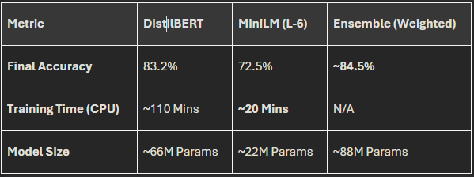

# SkySent: Airline Passenger Sentiment Analysis
### Transformer-Based Sentiment Classification with Ensemble Learning

SkySent is a modular, object-oriented machine learning pipeline designed to classify the sentiment of US airline-related tweets. The project evaluates the trade-offs between high-capacity models (**DistilBERT**) and ultra-lightweight architectures (**MiniLM**), ultimately combining them via a **Soft Voting Ensemble** to maximize predictive robustness.

---

## 🚀 Key Features

* **Object-Oriented Design**: A fully decoupled architecture using the **Factory Pattern** for model instantiation and a dedicated **DataManager** for robust preprocessing.
* **Gradual Unfreezing**: Implements a strategic fine-tuning schedule (freezing/unfreezing layers) to prevent "Catastrophic Forgetting" and stabilize training in CPU-bound environments.
* **Ensemble Learning**: A custom `SentimentEnsemble` class that utilizes **Weighted Soft Voting** to aggregate predictions from multiple Transformer backbones.
* **Lightweight Efficiency**: Detailed comparative analysis of model performance vs. computational latency, optimized for local execution.

---

## 🏗 Project Structure

```text
├── data/               # Raw and processed Twitter US Airline Sentiment data
├── notebooks/
│   ├── analysis.ipynb  # Main research and experimentation notebook
├── outputs/            # Saved .pt model weights and visualization plots
├── src/                # Modular Python source code
│   ├── models/         # TransformerClassifier and ModelFactory
│   ├── training/       # SentimentTrainer and FineTuningManager
│   ├── utils/          # DataManager and metrics (predict_sentiment)
│   └── __init__.py     # Package-level exports
├── README.md           # Readme file
└── requirements.txt    # Project dependencies 
```
---
## 🛠 Installation
### Clone the repository:
```
Bash
git clone [https://github.com/yourusername/skysent.git](https://github.com/yourusername/skysent.git)
cd skysent
```

### Install dependencies:
```
Bash
pip install -r requirements.txt
```
---
## 🧪 Methodology

### Model Selection
* **DistilBERT** (distilbert-base-uncased): Chosen for its balance of performance and speed, retaining ~97% of BERT's capabilities while being 40% smaller.

* **MiniLM** (ms-marco-MiniLM-L-6-v2): An ultra-lightweight model (~22M parameters) optimized for high-speed inference and low-resource training.

### Fine-Tuning: Gradual Unfreezing
To ensure the pre-trained weights were not corrupted by the initial large gradients of the classification head, we employed a 3-stage unfreezing process:
* **Stage 1:** Entire backbone frozen; head training only.
* **Stage 2:** Last 2 Transformer layers unfrozen.
* **Stage 3:** Full model unfreezing.

### Ensemble Strategy: Soft Voting
The project employs a Weighted Soft Voting mechanism. Instead of simple majority rule, we average the softmax probabilities from both models, weighted 0.6 (DistilBERT) and 0.4 (MiniLM) based on individual validation performance.

---

## 📊 Experimental Results

!

**Conclusion**: While MiniLM trained 5.5x faster, it suffered a ~10% accuracy drop. The Ensemble effectively bridged this gap, providing the most robust sentiment detection by leveraging the "wisdom of the crowd."

---

## 💻 Usage
## Single Inference Example
```python
from src import predict_sentiment, ModelFactory, TransformerClassifier
import torch

# Load your model, tokenizer, and classes
classes = ['negative', 'neutral', 'positive']

# Write a custom tweet
tweet = "The flight was delayed, but the cabin crew was amazing!"

result = predict_sentiment(
    text=tweet, 
    model=model, 
    tokenizer=tokenizer, 
    device=DEVICE, 
    classes=classes
)

print(f"Sentiment: {result}")
```
## 📜 License
#### Distributed under the MIT License.

---

## 👤 Author
***Konstantinos Seferlis***

AI Research & Development

[](https://www.linkedin.com/in/konstantinos-seferlis-b16bb7155/)